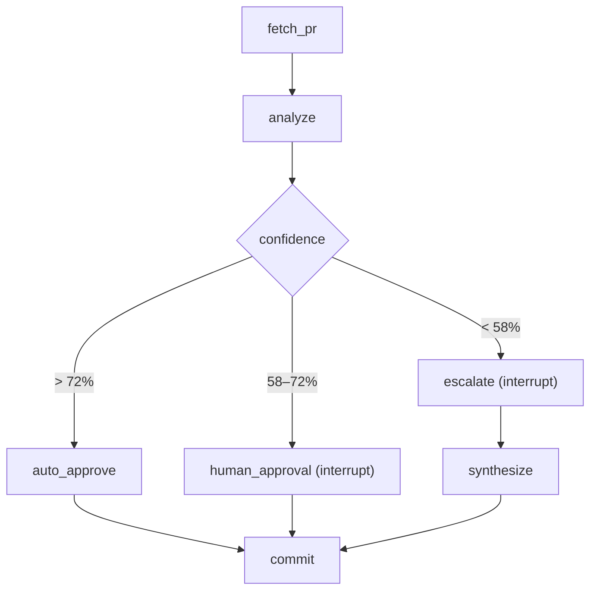

# HITL PR Review Agent Pro

HITL PR Review Agent Pro is an advanced Human-in-the-Loop (HITL) pull request analysis platform built on LangGraph and Streamlit. The system automates code reviews by triaging PR risk using dynamic confidence-based routing, enforcing manual gatekeeping for moderate risks, escalating critical queries for high-risk code, and compiling historical telemetry into a structured analytical dashboard.

---

## System Architecture

The engine utilizes a directed acyclic graph managed by LangGraph to process, route, and finalize pull requests. Intermediate states are persisted using SQLite checkpointers, enabling complete resiliency and timeline recovery.



---

## Key Features

- **Dynamic Confidence Routing**: Auto-triages PRs into three operational branches based on customizable LLM confidence boundaries.
- **Stateful Interruption (HITL)**: Halts pipeline execution using LangGraph `interrupt` gates to gather human consensus or detailed QA responses before proceeding.
- **Branching Time-Travel**: Allows reviewers to fork any historical checkpoint in the Sidebar to evaluate alternate logic paths independently without overwriting prior records.
- **Telemetry Dashboard**: Visualizes historical performance metrics, including the AI-vs-Human calibration curve, frequent risk-file hotspots, and response latency by persona.
- **Secure Token Vaulting**: Locally caches GitHub Personal Access Tokens (PAT) in a secure, Git-ignored `.env.local` file.

---

## Quick Start

### Prerequisites

- Python 3.11+
- [uv](https://docs.astral.sh/uv/) package manager
- An OpenRouter API Key
- A GitHub Personal Access Token (PAT) with `public_repo` (or `repo`) scopes enabled.

### Installation

1. **Clone the repository:**
   ```bash
   git clone https://github.com/Logm12/Lab27_MacPhamThienLong_2A202600384.git
   cd Lab27_MacPhamThienLong_2A202600384
   ```

2. **Install dependencies:**
   ```bash
   uv sync
   ```

3. **Set up environment variables:**
   Create a `.env` file in the root directory:
   ```ini
   OPENROUTER_API_KEY=your_openrouter_api_key
   GITHUB_TOKEN=your_github_personal_access_token
   ```

### Launching the Application

Execute the Streamlit control center:
```bash
uv run streamlit run app.py
```
Access the web console at `http://localhost:8501`.

---

## Operational Thresholds

The agent classifies pull requests into three confidence tiers defined in `common/schemas.py`:

| Confidence Score | Decision Tier | Process Action | Expected Path |
| :--- | :--- | :--- | :--- |
| **> 72%** | Auto-Approve | Commits review to GitHub without human intervention. | Low-complexity, minor typo fixes |
| **58% – 72%** | Human Review | Prompts user with Diff and AI analysis for Approve/Reject/Edit. | Moderate feature additions |
| **< 58%** | Strong Escalation | Halts to ask reviewer targeted contextual questions, then re-synthesizes the review. | High-risk security or architectural shifts |

### Test Cases for Evaluation
Two standard evaluation PRs are available under the `VinUni-AI20k/PR-Demo` public repository:
- **Moderate Risk (PR #1)**: `https://github.com/VinUni-AI20k/PR-Demo/pull/1` (Routes to `human_approval`).
- **High Risk (PR #2)**: `https://github.com/VinUni-AI20k/PR-Demo/pull/2` (Contains vulnerabilities like MD5 hashing, SQL injection. Routes to `escalate`).

---

## Repository Layout

```text
.
├── app.py                  # Streamlit Web Application & UI Layer
├── common/                 # Shared Infrastructure Modules
│   ├── database.py         # Checkpointer initialization & performance indexing
│   ├── github.py           # GitHub REST API interface & pre-flight validators
│   ├── llm.py              # ChatOpenAI factory configuration
│   └── schemas.py          # Core State, Pydantic models, and Threshold configurations
├── engine/                 # LangGraph Core Engine
│   ├── graph.py            # Workflow Graph wiring and compilation
│   └── nodes.py            # Individual workflow execution node definitions
├── audit/                  # Analytical Database Modules
│   ├── analytics.py        # High-performance metrics aggregation SQL queries
│   ├── replay.py           # Console-based session timeline playback utility
│   └── schema.sql          # Audit trails relational database schema
├── tests/                  # QA Harness and System Stress Testing Suites
└── pyproject.toml          # Poetry/UV Package definitions
```

---

## Database & Analytics

The system records dual-channel state tracking inside `hitl_audit.db` to maximize operational observability:

1. **Checkpointer Registry**: Saves exact LangGraph state binary blobs, facilitating seamless server resumption after network dropouts and supporting non-destructive Time-Travel branching.
2. **`audit_events` Ledger**: A highly indexable relational table mapping every state transition with metadata columns:
   - **Persona Action**: `fetch_pr`, `analyze`, `human_review`, `escalate`, `commit`
   - **Metrics**: Confidence scores, execution latencies (ms), and risk levels
   - **Payloads**: Developer IDs, finalized decisions, and flagged risk files

An indexed query execution plan is established via `idx_thread_time` (over `thread_id` and `timestamp`), keeping retrieval speeds well below **50ms** under load.

---

## Testing and Quality Assurance

The testing suite validates logic integrity, LLM responses, and edge cases:
```bash
uv run python -m pytest tests/
```
Standardized QA scripts are located in the `tests/` directory, validating strict token scoping and concurrent request handling.

---

## License

This project is licensed under the terms specified in the course assignment structure. Distributed for academic and enterprise lab review purposes.
